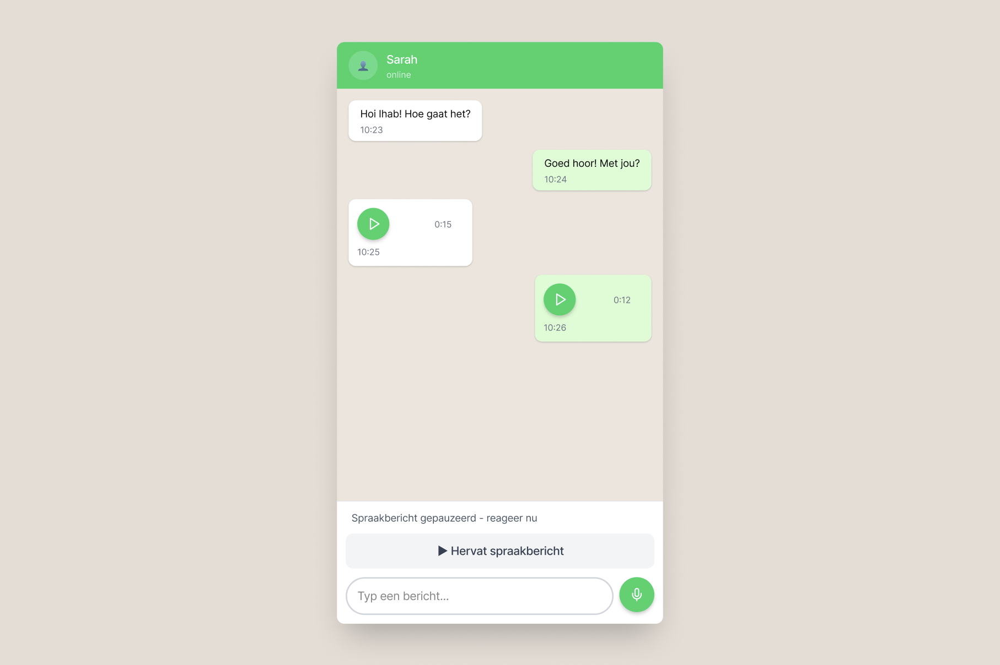
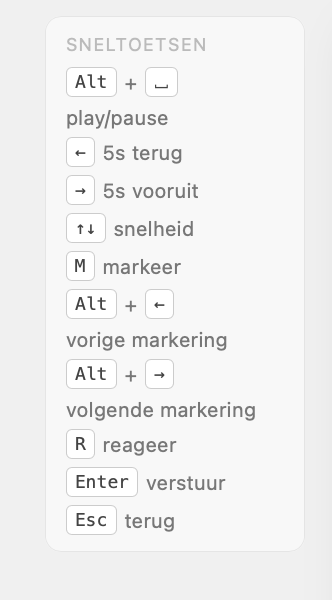
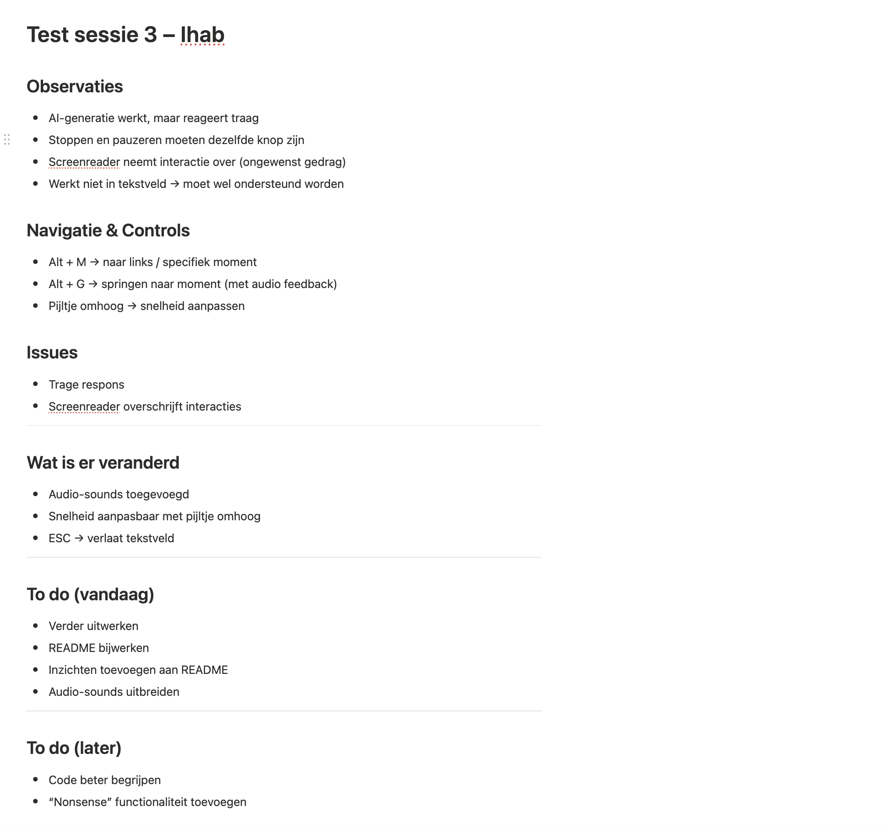
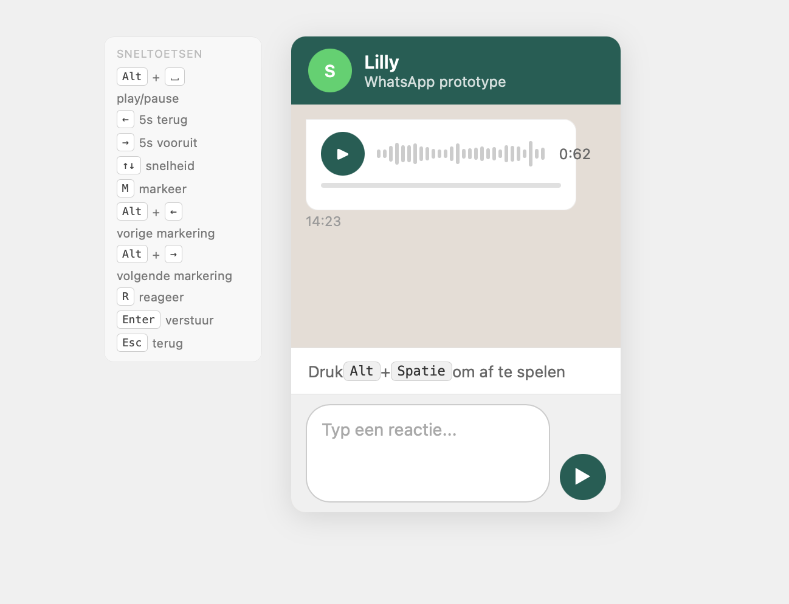

# HCD

## week 1

### Dag 1 — maandag 30 maart

**Wat heb ik gedaan?**
Vandaag kregen we de aftrap van het vak Human Centered Design. We kregen een introductie over accessibility en hoe mensen met een beperking het web gebruiken — met name mensen die schermleessoftware of andere hulptechnologieën gebruiken. De kern van de boodschap: het web is voor iedereen. Dat betekent dat we dingen kunnen maken die iedereen kan gebruiken. Maar kennen we iedereen wel?

In dit vak gaan we dat leren. Er zijn drie mensen uitgenodigd die elke week langskomen. We gaan voor één van deze mensen een prototype ontwerpen — heel specifiek, alleen voor die ene persoon. Deze mensen gebruiken het web op hun eigen manier, en het is onze taak om ervoor te zorgen dat ons prototype optimaal aansluit op hun voorkeuren en behoeften.

We werken met de **Exclusive Design Principles**:

- **Study situation** — bestudeer goed hoe jouw testpersoon het web en hun computer gebruikt
- **Ignore conventions** — negeer gangbare ontwerppatronen als dat nodig is, en bedenk een tailor made oplossing
- **Prioritise identity** — zorg dat de identiteit van jouw testpersoon zichtbaar is in het prototype
- **Add nonsense** — denk outside the box, ontwerp dingen die we nog niet kennen

Mijn testpersoon is **Ihab**. Na de introductie ben ik nagedacht over een eerste idee voor hem.

**Idee: Mood Intro**
Wanneer Ihab een pagina laadt, speelt er een kort intro-geluid (2-3 seconden) dat direct de sfeer en het type pagina aangeeft. Daarna speelt er een zacht achtergrondgeluid dat blijft lopen terwijl hij de pagina gebruikt. Zo weet hij meteen — zonder te lezen of navigeren — wat voor soort pagina hij heeft geopend.

Voorbeelden van sfeergeluiden per paginatype:

- Nieuws / webshop
- Zakelijk
- Natuur
- Event / feest
- Kinder
- Medisch
- Restaurant
- Sport
- Onderwijs
- Bank / finance

**Hoe lang duurde het?**
De hele dag — introductie in de ochtend, daarna nagedacht over het concept en het idee uitgewerkt.

**Wat heb ik geleerd?**
Dat inclusive design en exclusive design twee verschillende benaderingen zijn. Bij exclusive design ontwerp je niet voor iedereen tegelijk, maar juist heel specifiek voor één persoon. Dat vraagt om écht luisteren en observeren in plaats van aannames doen.

**Wat ga ik morgen doen?**
Voor dinsdag neem ik een aantal vragen mee voor Ihab zodat ik mijn idee beter kan uitwerken en aansluiten op hoe hij het web daadwerkelijk gebruikt. Ik wil weten hoe hij nu pagina's ervaart, wat hij fijn of frustrerend vindt, en of een audio-gebaseerde aanpak iets voor hem zou zijn.

### Dag 2 — dinsdag 31 maart

**Wat heb ik gedaan?**
Als eerste hebben we een test sessie gehad met Ihab. Ik heb goed geluisterd naar zijn ervaringen en frustraties met screenreaders en spraakberichten. Daarna heb ik mijn notities uitgewerkt en nagedacht over het concept. Het idee is ontstaan om de standaard screenreader te vervangen door een AI-stem die emotie kan overbrengen.

#### Observaties

**Over Ihab:**

- Hij heeft zijn eigen toetsenbord bij zich waarmee hij kan typen
- Hij stuurt veel spraakberichten als hij geen tijd heeft om te typen — dicteren werkt soms niet goed
- Spraakberichten ontvangen vindt hij fijn, omdat er meer emotie in zit
- Slecht leesbare websites zijn een groot probleem — afbeeldingen zonder alt-tekst zijn voor hem een must om te hebben
- Hij wil iets wat er nog niet is

**Wat is het probleem?**

- Lange spraakberichten (soms 4 minuten) luistert hij pas later — hij stelt het uit omdat het zoveel tijd kost
- Screenreaders hebben geen emotie, ze klinken saai en neutraal
- Irritaties komen vaak door elementen die niet goed gelabeld zijn

**Oplossingsrichtingen vanuit Ihab:**

- Een sneltoets waarmee hij kan pauzeren zodat hij de tijd heeft om te reageren
- AI-stemmen zijn menselijker en hebben meer emotie
- Het belangrijkste is tekst en spraak — het draait altijd om text-to-speech
- Screenreaders zijn saai en dat wil hij anders

**Hoe lang duurde het?**
De testsessie, uitwerken van de notities en observaties en bedenken van concept nam de hele dag in beslag.

**Wat heb ik geleerd?**
Ik heb geleerd hoe Ihab het web ervaart en wat zijn grootste frustraties zijn. Het belangrijkste inzicht is dat screenreaders geen emotie hebben, terwijl Ihab juist emotie heel belangrijk vindt want dat vertelde hij ook over zijn voorkeur voor spraakberichten.

**Wat ga ik volgendeweek doen?**
Volgende week ga ik onderzoeken hoe de Web Speech API werkt en wat de mogelijkheden zijn van AI-stemmen. Ik wil een eerste kleine test opzetten waarbij tekst wordt voorgelezen met een menselijkere stem, zodat ik volgende week iets concreets kan testen met Ihab.

## Weekreflectie — Week 1

Na de voorgang gesprekken die ik heb gehad met Leonie ben ik er achtergekomen dat het heel normaal is dat ik nog niks heb. Ihab is een ik wil natuurlijk maken wat goed is. Ik was nog heel erg aan het struggelen omdat ik nog geen idee heb wat ik wilde maken. Uit mijn observaties is hij opzoek wat hem helpt met spraakberichten en of ai stemmen voor screen readers. Dat lijkt voor mij best niet haalbaar, ookal wil ik hem helpen met zijn problemen. Met de voortgang gesprekken met leonie heb ben ik op nieuwe ideen gekomen. Zo zou ik misschien iets kunnen namaken dat dat iets voor whatsapp is zodat hij makkelijk zijn spraakmemo;s op stop kan zetten. Want nu als die een spraakopname krijgt dan wilt hij eig gelijk antwoord geven maar dat kan dat dus niet. Hij luisterd hem eerst helemaal af en maakt ie zelf een spraakmemo en gaat wilt hij dingen vertellen maar dan vergeet hij weer waar het over ging in de spraakmemo die die kreeg.
Of ik ga iets maken zodat op elke pagina hij een soort intro sound hoort en dan een beetje een sfeer krijgt van de website.

---

## week 2

### Dag 3 — Maandag 6 april

### Niet aanwezig want pasen

### Dag 4 — Dinsdag 8 april

**Wat heb ik gedaan?**
Vandaag test gehad met Ihab.

**Hoe lang duurde het?**
2 uurtjes test met Ihab.

**Wat heb ik geleerd?**

- Ihab wil de interface besturen met sneltoetsen, niet met de muis
- Een WhatsApp-achtige interface voelt voor hem vertrouwd
- Het idee van een voicebericht speler met markeer-functie slaat aan

**Wat ga ik volgende week doen?**
Volgende week ga ik het verder en groter uitwerken. Weet niet of ik de geluidjes ga gebruiken of niet. Zoals dat je begint met opnemen. Maar misschien iets van spraak terug van "neem spraak opname op" ipv een kleine soundje.

## Weekreflectie — Week 2

In week 2 ben ik erachter gekomen dat het Mood Intro idee te vaag was voor Ihab — hij wilde iets concreets waarmee hij echt zijn spraakmemo's beter kan gebruiken. Het WhatsApp-interface idee voelt veel beter: het sluit aan op zijn dagelijks gebruik. Ik heb besloten om de focus te leggen op een keyboard-first voicebericht speler waarbij je met sneltoetsen kunt navigeren, markeren en reageren.

---

## week 3

### Dag 5 — Maandag 13 april

**Wat heb ik gedaan?**
Keyboard-first interface uitgewerkt voor de voice memo prototype van Ihab. Ik heb een nieuw snelkoppelingensysteem bedacht en gebouwd met de volgende functies: Space voor play/pause, pijltjes voor 5 seconden voor/achteruit, Alt+M om een moment te markeren als badge, Alt+G om naar een markering te springen, T voor een AI-gegenereerde transcriptie van ~10 woorden rondom het huidige punt, R om een tekstreactie te starten (pauzeert automatisch en opent spraakherkenning indien beschikbaar) en Enter om de reactie te versturen als WhatsApp-bubbel.

**Hoe lang duurde het?**
Hele dag mee bezig geweest.

**Wat heb ik geleerd?**
Door vooraf na te denken over welke acties Ihab het vaakst nodig heeft, kon ik een logische snelkoppelingenstructuur opzetten. Het gebruik van Alt als modifier voorkomt conflicten met standaard browsergedrag.

**Wat ga ik morgen doen?**
De interface testen met Ihab en kijken waar hij vastloopt.

### Dag 6 — Dinsdag 14 april

**Wat heb ik gedaan?**
Gebruikerstest gedaan met Ihab. Hieruit kwamen een aantal duidelijke bevindingen: stoppen en pauzeren moeten dezelfde knop zijn (nu beide Space), de screenreader liep steeds over de interface heen waardoor de focus management aangepast moet worden, snelkoppelingen werkten niet als de focus in een tekstveld zat, de afspeelsnelheid was te hoog voor Ihab (pijltjes omhoog/omlaag toegevoegd voor snelheidsregeling) en de markeerfunctie miste audio-feedback en navigatie. Op basis van de test heb ik de shortcutlijst bijgewerkt en een to-do opgesteld voor de vervolgstap.

**Hoe lang duurde het?**
Hele dag mee bezig geweest.

**Wat heb ik geleerd?**
Dat snelkoppelingen die logisch lijken voor een ziende gebruiker anders uitpakken voor iemand die een screenreader gebruikt. Focus management is cruciaal — als de screenreader de interface overneemt, verliest de gebruiker de context van wat er speelt. Ook bleek dat het onderscheid tussen "stoppen" en "pauzeren" voor Ihab niet relevant is; één knop werkt beter.

**Wat ga ik volgende week doen?**
Prototype verder uitwerken, README schrijven met inzichten, audio sounds toevoegen bij markering en navigatie, en focus management fixen zodat de screenreader niet over de controls heen loopt.

## Weekreflectie — Week 3

Week 3 was de week dat het prototype echt vorm begon te krijgen. De testsessie met Ihab was heel waardevol — ik merkte dat ik veel aannames had gemaakt over hoe hij zou navigeren. Het grootste inzicht was dat focus management alles bepaalt: als de screenreader focus heeft op een element dat ik niet verwacht, valt de hele sneltoetsstructuur weg. Ik ga volgende week de screenreader-laag echt goed aanpakken.

---

## week 4

### Dag 7 — Maandag 20 april

**Wat heb ik gedaan?**

Audio-ondersteuning toegevoegd via de Web Audio API. Concreet:

- Geluidseffecten bij afspelen, pauzeren, versturen en springen naar markeringen
- Snelheid aanpassen met pijltjes omhoog/omlaag
- Escape verlaat het tekstveld en geeft spraakfeedback
- Spraak via SpeechSynthesis bij versturen en terugkeren naar markering

**Hoe lang duurde het?**

De hele dag.

**Wat heb ik geleerd?**

- Hoe de Web Audio API werkt met een oscillator en gain node om tonen te genereren
- Hoe je SpeechSynthesis combineert met UI-acties voor toegankelijke feedback
- Hoe je keyboard events afhandelt zonder dat ze botsen met invoervelden

**Wat ga ik morgen doen?**

Testen met Ihab.

### Dag 8 — Dinsdag 21 april

**Wat heb ik gedaan?**

Getest met Ihab. De volgende problemen zijn naar voren gekomen:

- Screen reader praat te veel door de UI heen
- Sneltoetsen worden niet goed gehighlight bovenaan de pagina
- Alt+m is overbodig — M markeert al
- Bug: teruggaan naar vorige markering springt naar het huidige moment in plaats van de vorige (bijv. zit op 18s, wil naar 6s, springt naar 12s)
- Sneltoetsen werken niet in het tekstveld
- Spatie moet Alt+Spatie worden zodat het ook in het tekstveld werkt
- Focus zat niet goed bij het spraakbericht — sprong naar markering in plaats van tekstveld

**Hoe lang duurde het?**

De hele dag.

**Wat heb ik geleerd?**

- Testen met een echte gebruiker laat snel zien waar de prioriteiten liggen
- Focus- en sneltoetsbeheer is complexer zodra een screen reader erbij komt
- Kleine navigatiebugs (zoals de markering) vallen pas op in echte gebruik

**Wat ga ik morgen doen?**

- Screen reader gedrag fixen zodat hij niet door de UI heen praat
- Markeringnavigatie fixen (zoals Spotify: altijd écht terug naar vorige)
- Spatie omzetten naar `Alt+Spatie` zodat het in het tekstveld werkt
- Sneltoetsen overzicht opschonen en beter zichtbaar maken

## Weekreflectie — Week 4

In week 4 heb ik alle bugs uit de test van dinsdag gefixed. De drie grootste verbeteringen: de screenreader leest niet meer door de hele interface heen (tabvolgorde opgeschoond, aria-live alleen op de statusbalk), de markeernavigatie werkt nu zoals Spotify — als je net voorbij een markering zit ga je terug naar de vorige, anders ga je terug naar die markering zelf. En `Alt+Spatie` werkt nu ook in het tekstveld. Tot slot is de shortcutlegenda naar boven verplaatst en heeft het prototype een grappig nonsense-element gekregen: Lilly reageert met willekeurige emoji-reacties als je een moment markeert.

Er zijn nog een paar fouten is dat de screan reader over de text gaat van de gebruiker als de gebruiker iets markeert of terug markeert. Hier moet ik nog even naar kijken.

---

## Eindresultaat — Sneltoetsen overzicht

| Toets            | Actie                            |
| ---------------- | -------------------------------- |
| `Alt` + `Spatie` | Play / Pause (ook in tekstveld)  |
| `←`              | 5 seconden terug                 |
| `→`              | 5 seconden vooruit               |
| `↑` / `↓`        | Snelheid omhoog/omlaag           |
| `M`              | Markeer huidig moment            |
| `Alt` + `←`      | Vorige markering (Spotify-stijl) |
| `Alt` + `→`      | Volgende markering               |
| `R`              | Start tekstreactie               |
| `Enter`          | Verstuur reactie                 |
| `Esc`            | Terug naar speler                |

---

## Bronnen

- Vasilis van Gemert — [Exclusive Design](https://exclusive-design.vasilis.nl/) (2018)
- MDN Web Docs — [Web Audio API](https://developer.mozilla.org/en-US/docs/Web/API/Web_Audio_API)
- MDN Web Docs — [SpeechSynthesis](https://developer.mozilla.org/en-US/docs/Web/API/SpeechSynthesis)
- MDN Web Docs — [KeyboardEvent](https://developer.mozilla.org/en-US/docs/Web/API/KeyboardEvent)
- MDN Web Docs — [ARIA: role="slider"](https://developer.mozilla.org/en-US/docs/Web/Accessibility/ARIA/Roles/slider_role)
- W3C — [WAI-ARIA Authoring Practices](https://www.w3.org/WAI/ARIA/apg/)
- WebAIM — [Keyboard Accessibility](https://webaim.org/techniques/keyboard/)
- Spotify — inspiratie voor markeer-navigatie gedrag (terug naar vorige markering met threshold)
